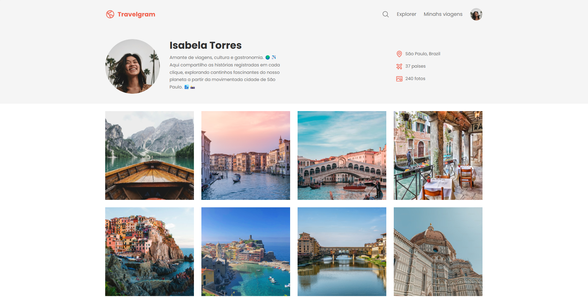

# Travelgram

Travel profile project created during studies.



## About

This project is a simple web page presenting a travel profile in the style of Instagram. The page displays photos of tourist destinations with a modern and responsive interface, simulating a social network focused on travel.

## Tech Stack

- HTML
- CSS

## Design

- [Figma](https://www.figma.com/design/JEMj0VQCqK7ENIm1vayL9a/Perfil-de-viagens--Community-?m=auto&t=HMF6kf1r1gTF1Axq-6)

## How to run

```bash
# Clone this repository
git clone https://github.com/sillasemanoel/study-travelgram

# Enter the project folder
cd study-travelgram

# Open the index.html file in your browser
```

## Author

Sillas Emanoel
